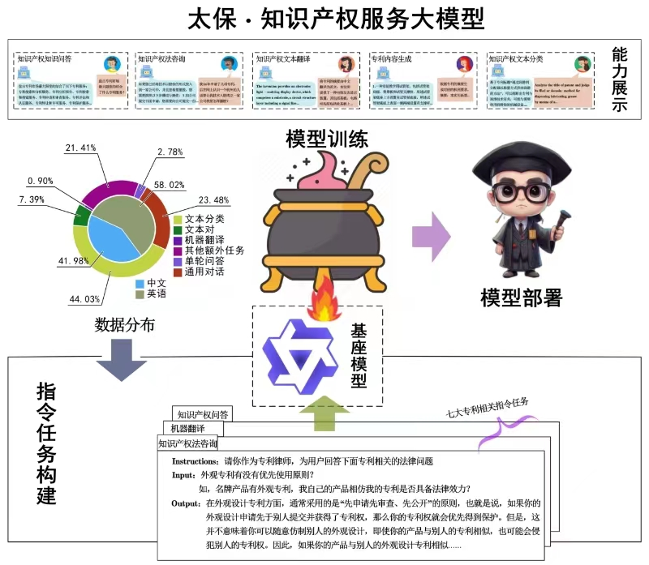

[ [English](./README_en.md) | **中文** \]

         <a href="http:taibao-ip.help/">项目体验</a>&nbsp&nbsp | &nbsp&nbsp <a href="https://spap.dlut.edu.cn/info/1123/4095.htm">学院新闻</a>
 
 

# 太保（Taibao）：知识产权服务大模型

## 项目背景

知识产权作为一种激励和保护创新的制度安排，在现代社会中的重要性日益增强，成为了衡量一个国家综合国力的重要指标。知识产权包括著作权、商标权、专利权、商业秘密权等，在鼓励知识创新、保护技术资源、提升经济效率中均具有重要的作用。知识产权公共服务是指政府或其他相关机构提供的面向社会大众的知识产权信息和服务，既是国家公共服务体系的重要组成部分，也是国家创新体系的重要组成部分。为贯彻落实国务院关于加快推进政务服务标准化规范化便利化的指导意见，国家知识产权局印发《知识产权公共服务普惠工程实施方案（2023—2025年）》，旨在通过建设覆盖更广、效能更高、服务更好、体验更佳的知识产权公共服务体系，实现政策更加普惠公平、服务更加普惠可及、数据更加普惠开放。

在信息化与时代化的时代背景下，越来越多的企业和个人开始重视知识产权保护，大数据和人工智能等技术的普及与发展，使更加精准和个性化的服务成为可能，知识产权智能服务也随之发展，可以更好地处理和分析海量知识产权数据，提供更精准、快速的服务，以满足多样化的用户需求。

传统的知识产权信息检索工具往往由于功能单一、操作复杂、检索效率低等原因无法满足用户的多样化需求，而知识产权领域的大语言模型可以使用户更好地了解和保护自己的知识产权，提高知识产权检索的效率与准确度，促进知识产权的转化和应用。目前已有的开源知识产权大模型稀少，同时针对知识产权的相关开源数据大多不适用于NLP任务。

基于此，本项目聚焦高水平科技自立自强和创新发展背景下公众对于知识产权信息的需求，充分整合知识产权现有数据资源，面向知识产权专利领域的数据集开展大模型研究，研发了现阶段首个知识产权公共服务大模型，旨在满足社会知识产权公共服务的多元化需求，为技术发明创新工作提供快捷的辅助支持，探索大模型在知识产权领域中自然语言处理多任务的应用能力。

## 模型介绍

当前的太保是利用基座模型Qwen-7B通过指令任务LoRA有监督高效微调得到的。70亿参数的通义千问（Qwen-7B）基座模型在近2.5万亿Tokens的中英、代码、数学乃至专业领域的高质量语料中进行了多轮预训练，初步具备了指令理解的能力，其自然语言处理与理解的能力在国内诸多开源大模型中名列前茅，显著超出同规模模型并紧追一系列最强的闭源模型。

该模型着力于知识产权智能服务领域，围绕知识产权的创造、管理、保护、运用等重要环节开展研发，旨在为用户提供全方位快捷有效的知识产权服务。

## 整体框架图

     
    
     

- 出色的中英双语训练：通过丰富的中英双语任务指令数据进行大模型指令微调，使模型具备了出色的中英双语知识产权相关问题智能问答、知识产权咨询对话、知识产权中的专利摘要/权利要求生成、知识产权文本分类、知识产权文本翻译、标题生成等多种知识产权分析能力。
- 准确的专业问答：面向知识产权领域的大语言模型经过大量知识产权领域的文本数据训练，这些训练数据涵盖了丰富的专业知识和信息，能够深入学习和理解专业词汇、语法、语境等，从而更加准确地处理和回答知识产权领域的各种问题。同时，在模型训练过程中通过优化算法进行不断调整和优化，使得模型更好地适应知识产权领域的数据分布和任务需求，提供较好的公共服务。
- 优秀的泛化能力：除了知识产权领域，模型仍具备通用领域对话能力，并通过设计指令模板多样性，使模型具备了较优秀的指令理解能力，在同类任务的不同场景下具有较好的泛化能力，并激发了模型一定的零样本学习能力。

## 目录
- [太保（Taibao）：知识产权服务大模型](#太保（Taibao）：知识产权服务大模型)
  - [项目背景](#项目背景)
  - [模型介绍](#模型介绍)
  - [整体框架图](#整体框架图)
  - [目录](#目录)
  - [训练数据](#训练数据)
  - [模型训练](模型训练)
  - [核心功能展示](核心功能展示)
  - [总结](#总结)
  - [开发团队](#开发团队)

## 训练数据

本项目收集了大量中英文专利研究相关数据及相关数据集，覆盖五大类共专利自然语言处理任务文本分类（专利类型，IPC分类号分类），文本翻译（中英文互译），文本生成（生成标题摘要权利要求），对话（专利相关对话，通用对话），文本对任务（语义相似度，文本蕴含），根据数据集质量筛选和过滤后，在数据统一格式的基础上，借鉴LLaMA-Efficient-Tuning项目，设计多种指令模板并进行指令数据转化。同时，为了保留通用领域对话能力，本项目还加入了通用对话数据。

## 模型训练

**基座介绍**：当前“太保”知识产权服务大模型以阿里云的Qwen-7B系列模型为基座。

**模型调试**：本项目在6张 Nvidia 3090 24GB 显卡上使用LoRA进行指令微调测试，训练代码在 LLaMA-Efficient-Tuning 开源项目的基础上进行了修改。项目训练集包含约136000条训练样本，可训练参数大约7百万，每个epoch的训练时间约为24小时。

## 核心功能展示

本项目围绕知识产权创造、运用、保护和管理四个主要环节研发知识产权大模型，以期提供更加全面系统的知识产权智能服务。（1）在知识产权创造方面，我们提供了内容生成（摘要、标题、权利）、知识产权文本中英文互译等功能服务。（2）在知识产权管理方面，我们提供了知识产权智能问答、知识产权文本分类及正确性判断、知识产权相关性辨析、知识产权制度等功能服务。（3）在知识产权保护方面，我们提供了知识产权法咨询、知识产权申请咨询等服务。（4）在知识产权运用方面，我们提供了知识产权转让咨询、知识产权转化咨询等服务。

## 总结

“太保”关注于知识产权领域的信息服务，通过大量的专利文本数据训练具有较强的专业素养，在知识产权知识智能问答、知识产权专利法咨询、知识产权专利文本翻译等方面展现了更加准确、客观的信息和服务。

通过上述示例，我们可以看到“太保”在知识产权领域有着不俗的表现。然而，它仍然存在一些大型模型普遍存在的问题，例如幻觉现象，可能导致提供虚假或不存在的知识产权相关信息；知识储备有限，以及在长篇文本分析方面的处理能力较弱等。此外，还需注意数据量不足可能导致模型泛化能力受限；偏见问题可能使模型在处理某些特定场景时产生不公平的结果；误解问题可能使模型在理解复杂或模糊的文本时出现错误。为了进一步提升“太保”的能力，未来的研究将着重于知识库构建、基于人类反馈的强化学习以及安全可靠性等方面，从而使得“太保”能够提供更高质量的知识产权服务。

## 开发团队
“太保”知识产权服务大模型依托于国家知识产权战略实施（大连理工大学）研究基地的建设项目，由大连理工大学公共管理学院与大连理工大学信息检索研究室（DUTIR）联合开发完成，由公共管理学院数字治理研究所所长林原副教授主持设计开发，并由各位老师和同学协同努力完成，具体项目成员情况如下：

指导设计组：丁堃，林鸿飞，王欢明，杨中楷，许侃

实施开发组：王琪尧，许晨曦，黄建国，武嘉旭，张士良

项目体验地址：http://taibao-ip.help/

本项目专注于知识产权领域大语言模型研究，我们期望本项目能在知识产权领域的大语言模型应用研究中起到抛转引玉的作用，目前的体验仅为知识产权相关工作提供服务和参考，请您在使用中自行判断其适用性和准确性。作为一个学术研究团队，我们无法提供长期的在线服务，建议大家后续通过本项目开源模型自行体验，并共同致力于完善知识产权服务智能平台。

## 致谢
- Qwen：https://github.com/QwenLM/Qwen
- LLaMA-Efficient-Tuning：https://github.com/littepan/LLaMA-Efficient-Tuning
- “太保”logo 由文心一言AI合成

## Star History

